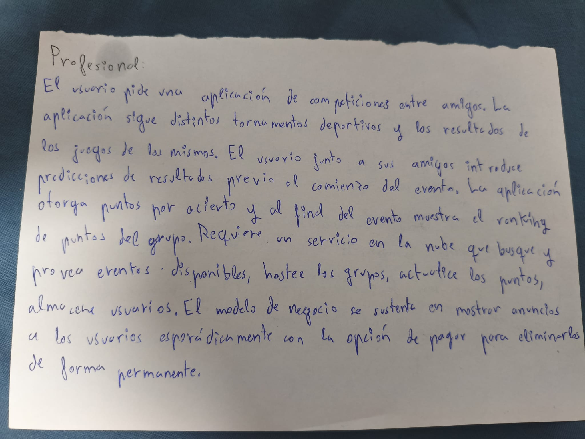

# proyecto_curso_2627

# problema a resolver:
Mis amigos y yo actualmente usamos Excel para hacer una especie de liga entre todos, en la que tenemos que acertar los resultados de los partidos del mundial de fútbol, 
ganando el que mas resultados haya acertado a lo largo del torneo. El problema es que manejar Excel para poner los resultados de cada partido es muy tedioso y largo, ademas de que solo 
la persona que ha creado el excel puede ver los resultados en tiempo real, mientras que el resto de participantes tienen que esperar a que se les pase una foto de la tabla para ver su posicion en ella, y el sistema de puntuación por acertar resultados en el Excel es muy básico y rudimentario, sin margen de personalizar el sistema de puntuación para cada torneo, por ejemplo, que da los mismos puntos por acertar un resultado obvio que uno improbable, o que no diferencia a quien acierta muchas veces seguidas de quien acierta de forma aislada.

# Referencias
Algunas app de referencias son las ligas fantasy de football.

# Lenguajes
Usaré Python como lenguaje para realizar el proyecto
