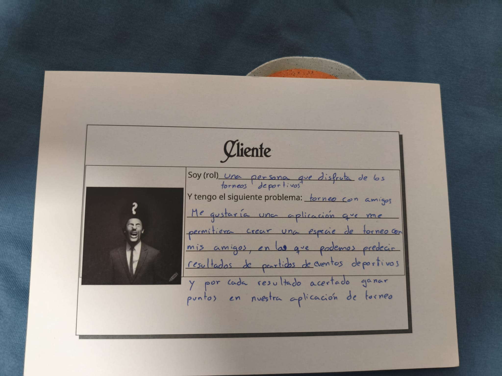
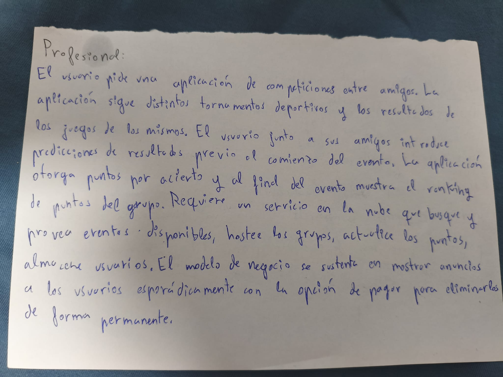

# proyecto_curso_2627

# Problema a resolver:
Soy un estudiante universitario, y como tal a menudo suelo ir bastante justo de dinero. Usar el transporte publico todos los dias, puede suponer un gasto importante a final de mes. Se que hay distintas opciones (billetes sencillos, bonos de 10 viajes, abonos mensuales por zonas, descuentos de joven o de familia numerosa,...)  que pueden abaratar el uso del transporte publico, pero no se cual me renta usar teniendo en cuenta que hay periodos en los que no voy a clase ya sea porque hay vacaciones o varios dias festivos consecutivos y si en verdad el descuento que estoy usando me permite el menor coste posible o existe otro que me es mas barato.

# Datos del problema

## Introduccion de datos
Los datos se obtienen y procesan directamente de del calendario de la universidad y la pagina web  del metro y buses interubanos:

https://secretariageneral.ugr.es/sites/webugr/secretariageneral/public/ficheros/puntoCGh_calendarioacademico2627.pdf pEs el calendario académico oficial del curso 2026/2027 para grados de la ugr

Tarifas de autobús interurbano: http://www.movilidadgranada.com/bus_tarifas.php Contiene una tabla con el concepto de cada título de transporte (billete  ordinario, Credibús, Bono Joven, Bono Mensual...) y su coste en euros

https://metropolitanogranada.es/tarifas Contiene varias tabla con los tipos de tarjeta, su precio y las condiciones de uso

## procesamiento
No basta con coger la tarifa más barata de percio, hay que ver si esa tarifa se adecua a la situcion academica de ese momento, es posible que un bono mensual salga mas barato que otras tarifas, pero si la mitad de ese mes no hay clases porque dan vacaciones y no voy a usar el transporte publico, es posible que rente mirar otras opciones que hagan que me salga mas barato en vez de paga un bono de un mes entero que puede caducar sin haberlo gastado. Además de que existen algunas tarifas con restricciones (edad, empadronamiento, disponibilidad...) que hay que comprobar antes de poder elegir esa tarifa. Es necesario calcular el del coste mínimo óptimo de billetes dados y el numero días de clase y festivos y con las retricciones .

## Despliegue en la nube
Como es posible que durante el curso haya cambios tanto en el calendario (que haya huelga y no haya clase, o haya un evento en la facultad, ...) como en las tarifas ( que cambien el precio de la tarifa, que ya no esta disponible dicha tarifa, ...) no basta con calcular una vez al principio, es necesario que se comprueben los horarios y las tarifas por si hay cambios inesperados

# Referencias
Algunas aplicaciones de referncia son Cittymaper o Omio

# Lenguajes
Usare Python como lenguaje para realizar el proyecto

# Documentacion adicional
Captura de la configuracion de Git: [ver aqui](docs/config_git.png)
Captura de la clave ssh: [ver aqui](docs/ssh.png)