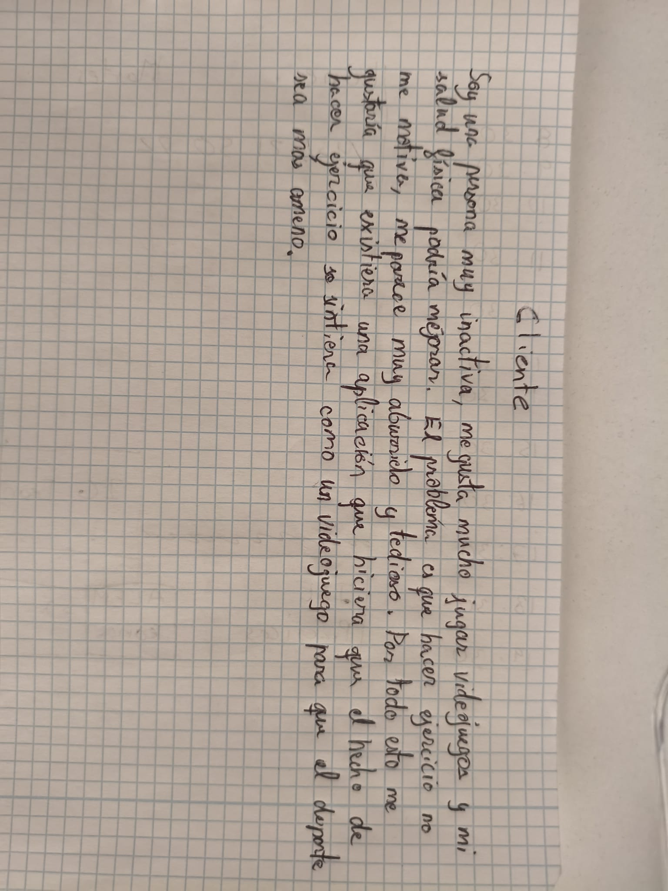
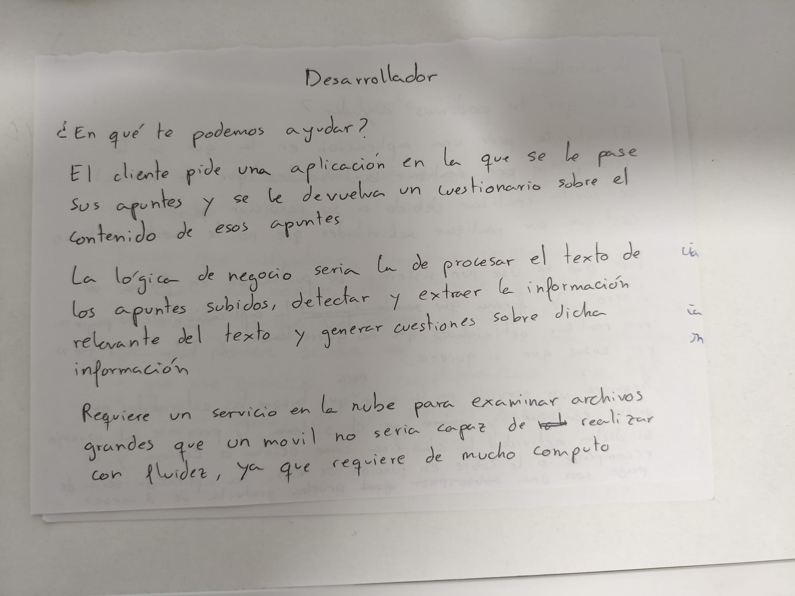

# proyecto_curso_2627

# Problema a resolver:
Mi primo es un estudiante de medicina que tiene que estudiar tomos de teoria de hasta 200 paginas, haciendo que el estudio de las asignaturas sea muy denso y pesado, haciendo que se canse facil mentalmente y le cueste esfuerzo extra tener que recordar todo lo que se ha estudiado.

# Datos del problema

## Introduccion de datos
Los datos de entrada son los apuntes en PDF del propio usuario, normalmente descargado de otras plataformas donde tienen apuntes de su asignatura correspondiente o apuntes hechos a mano y escaneados posteriormente, sin que el sistema tenga que buscar ni consultar ninguna fuente externa por su cuenta. 

## procesamiento
En unos apuntes de 200 páginas en los que aparecen numerosos conceptos nuevos y diferentes, como nombres de partes del cuerpo, medicamentos o enfermedades, puede resultar complicado determinar qué información es más importante para el estudio y cuál tiene una relevancia secundaria.. Además de que las preguntas generadas tienen que tener sentido con los apuntes proporcionados para que el repaso sea efectivo 

## Despliegue en la nube
Se utilizará un servidor en la nube para realizar el procesamiento de los archivos y la generación de los cuestionarios. El procesamiento de documentos de gran tamaño y la generación de múltiples preguntas pueden requerir una capacidad de cómputo elevada, por lo que realizar todo el proceso directamente en un dispositivo móvil podría resultar más lento o consumir demasiados recursos.

El uso de un servidor con mayores recursos permitirá realizar este procesamiento de forma más eficiente y devolver posteriormente el cuestionario generado al usuario.

# Referencias
AnkiDecks

# Lenguajes
Usare Python como lenguaje para realizar el proyecto

# Documentacion adicional
Captura de la configuracion de Git: [ver aqui](docs/config_git.png)
Captura de la clave ssh: [ver aqui](docs/ssh.png)